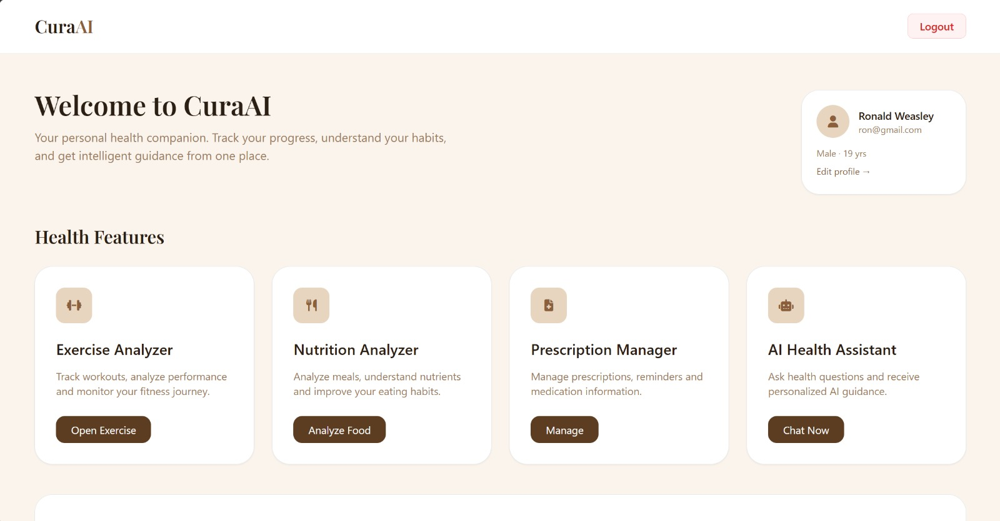
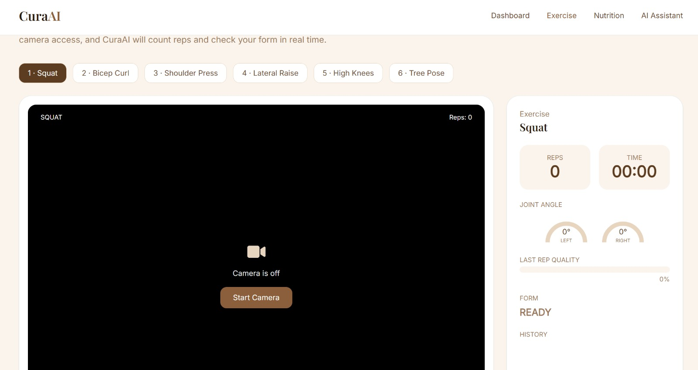
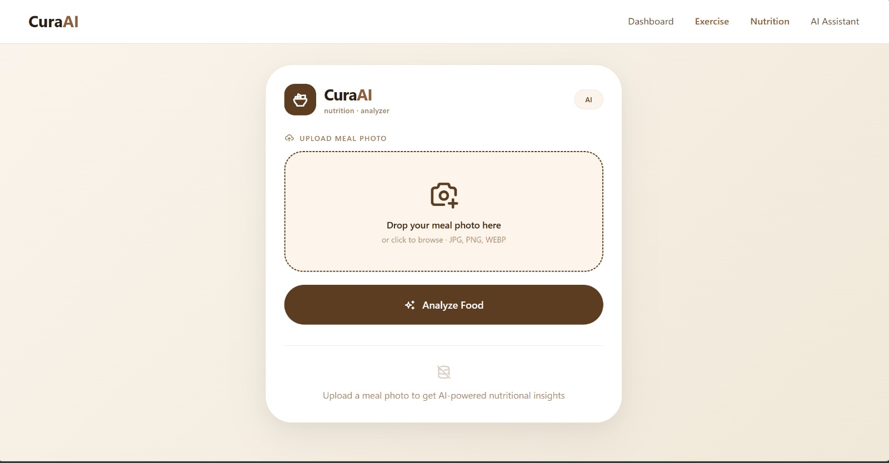
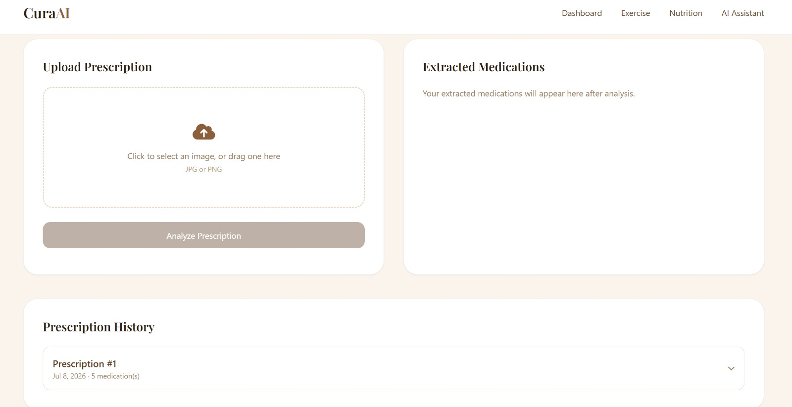
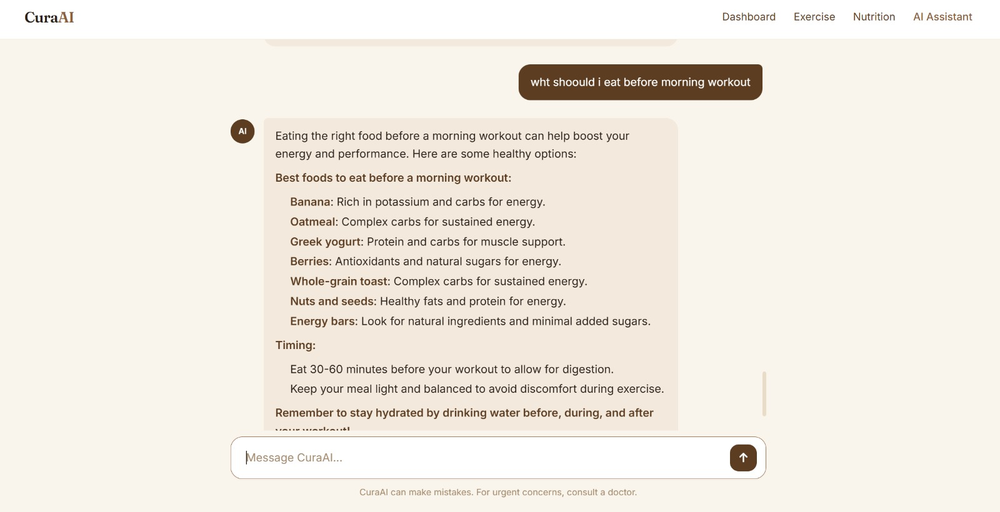

# CuraAI 

**Intelligent Health Companion**

## Overview

CuraAI is an AI-driven healthcare assistant that brings multiple health management tools into a single platform. It helps users monitor workouts, analyze food nutrition, digitize handwritten prescriptions, and receive AI-powered health guidance through an interactive chatbot.

Our goal is to make everyday healthcare more accessible, organized, and personalized using Artificial Intelligence.

---

## Features

### AI Exercise Tracker

* Real-time pose estimation
* Exercise detection and tracking
* Repetition counting
* Posture analysis
* Daily exercise history and workout logging
* Weekly progress analysis with exercise statistics 

Supported exercises:

* Bicep Curl
* Squat
* Lateral Raise
* Shoulder press

---

### Food Calorie Analyzer

* Upload food images
* AI-based food recognition
* Calorie estimation
* Nutritional information display
* Automatic daily meal and calorie logging
* Daily calorie consumption analysis
* Weekly nutrition statistics

---

### Prescription Analyzer

* Upload handwritten prescriptions
* OCR-based text extraction
* Medicine name and dosage recognition
* Secure digital prescription storage

---

### AI Health Chatbot

* Natural language conversations
* General health and wellness guidance
* Lifestyle recommendations
* Interactive health support

> **Disclaimer:** The chatbot provides general health information only and is **not a substitute for professional medical advice, diagnosis, or treatment.**

---

## Tech Stack

### Frontend

- HTML
- CSS

### Backend

- JAVA
- Spring Boot 

### AI & Machine Learning

* Python
* OpenCV
* Groq API
* GEMINI API
* MediaPipe Pose
* VisionLLM (OCR + structered extraction)
* Large Language Model API
* PyTorch 

### Database
-Aiven for MySQL (Managed Cloud Database)

---

## Project Structure
## Project Structure

```text
CuraAI/
│
├── curaai/
│   ├── src/
│   │   ├── main/
│   │   │   ├── java/
│   │   │   │   └── com/curaai/curaai/
│   │   │   │       ├── config/
│   │   │   │       ├── controller/
│   │   │   │       ├── dto/
│   │   │   │       ├── model/
│   │   │   │       ├── repository/
│   │   │   │       ├── service/
│   │   │   │       └── CuraaiApplication.java
│   │   │   └── resources/
│   │   └── test/
│   ├── .mvn/
│   ├── Dockerfile
│   ├── pom.xml
│   ├── mvnw
│   ├── mvnw.cmd
│   └── .gitignore
│
├── mediapipe-tasks-vision-0.10.14/
├── screenshots/
├── README.md
└── LICENSE
```


---
## Prerequisites

- Python 3.11+
- Java 21
- Maven
- Git
  

### Clone the Repository

```bash
git clone https://github.com/sparkkdusk/CuraAI.git
```

```bash
cd CuraAI
```

## How to Use

1. Launch the application.
2. Sign in or create an account.
3. Select one of the available modules:

   * Exercise Tracker
   * Food Calorie Analyzer
   * Prescription Analyzer
   * AI Health Chatbot
4. Follow the on-screen instructions.
5. View and save your results.

---
## Screenshots

### Home Screen



---

### AI Exercise Tracker

**Exercise Detection**


---

### Food Calorie Analyzer

**Food Upload**


---

### Prescription Analyzer

**Prescription Upload**


---

### AI Health Chatbot

**Chat Interface**


**Health Consultation**


## Future Improvements

* Additional exercise detection
* Personalized workout plans
* Medication reminders
* Wearable device integration
* Multi-language support
* Health analytics dashboard

---
## Team Name
**Thistle Spirals**
## Team Members

* Monira Akter Mim
* Shresta Chakma
---

## License

This project was developed for the **Sciblitz 2.0 AI Hackathon** and is intended for educational and research purposes.
